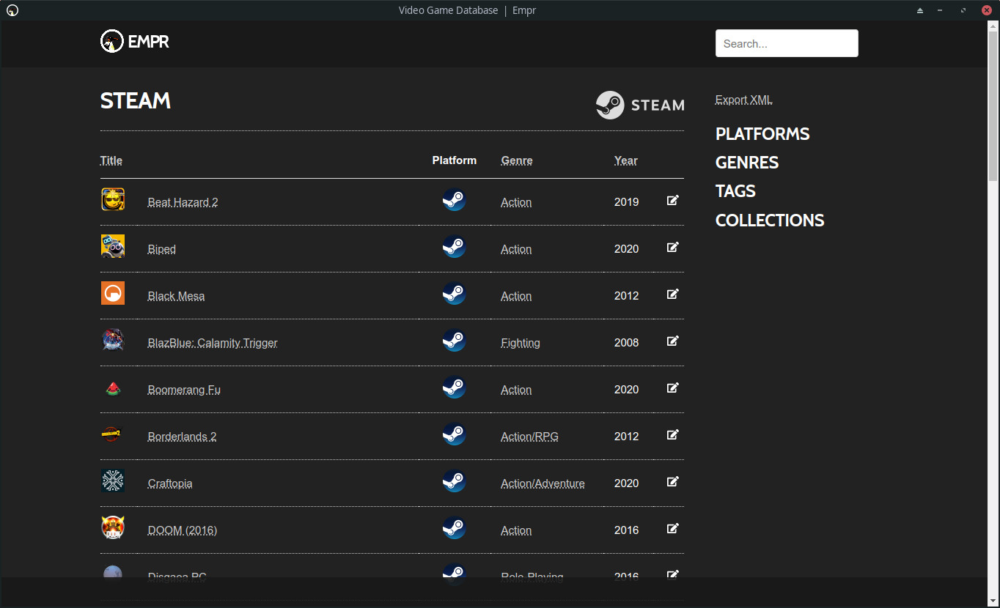

# Empr

Video game library manager.

**\*In development\***

Empr is a video game library manager powered by Django. Games can be scrape into the video game database which can be exported to an xml format compatible with EmulationStation.

## Features

- Filter by Platform, Genre, or Tag
- Group games by Collection
- Game scraper
- Export database to EmulationStation

## Planned development

- Port Bash scripted utilities to Python
- Add game launcher to browser
- Archive management
- Server utilities
	+ Download/install
	+ Save sync
	+ Database backup
